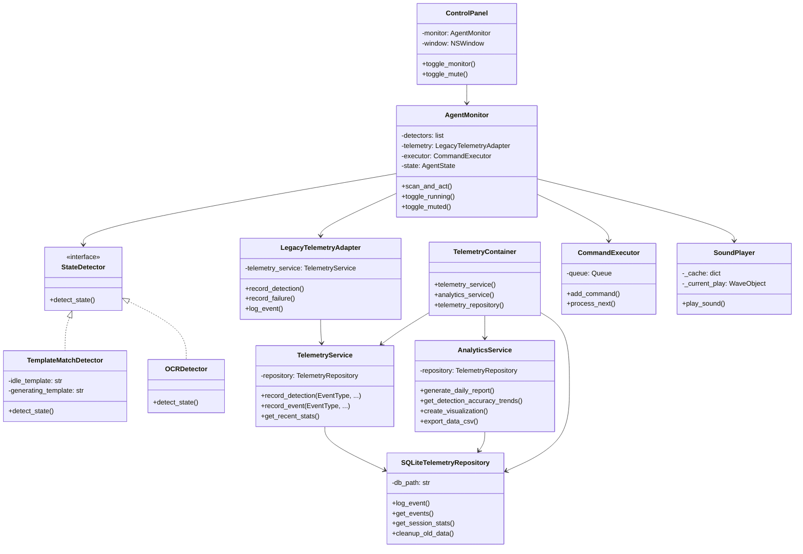
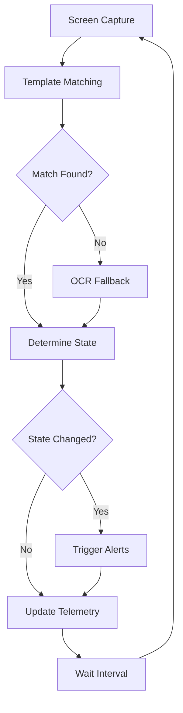

# Cursor Agent Manager

This project is a **Proof of Concept (POC)** for macOS that demonstrates how to build a screen monitoring utility. Its primary goal is to show how one can monitor a specific region of the screen to track the state of an AI assistant, such as the one in the Cursor IDE.

**This is not a production-ready application.** Instead, it serves as a technical example, complete with a modern UI featuring emoji status indicators, professional asset organization, state management, and multi-modal detection strategies (template matching, OCR). It's a good starting point for anyone looking to build tools that interact with GUIs on macOS.

## Table of Contents
- [Cursor Agent Manager](#cursor-agent-manager)
  - [Table of Contents](#table-of-contents)
  - [Features](#features)
  - [Architecture](#architecture)
    - [Component Overview](#component-overview)
    - [Detection Flow](#detection-flow)
  - [Installation](#installation)
  - [Usage](#usage)
    - [Project Structure](#project-structure)
    - [Key Dependencies](#key-dependencies)
  - [Configuration](#configuration)
    - [Template Images](#template-images)
    - [Sound Alerts](#sound-alerts)
  - [Development](#development)
    - [Workflow](#workflow)
    - [Roadmap](#roadmap)
    - [Developer Notes \& Gotchas](#developer-notes--gotchas)
  - [Telemetry \& Analytics](#telemetry--analytics)
    - [Database Storage](#database-storage)
    - [Analytics CLI](#analytics-cli)
    - [Data Visualization](#data-visualization)
    - [Enhanced Recording](#enhanced-recording)

## Features

- **Visual Detection**: Uses OpenCV template matching to detect AI agent states with confidence scoring.
- **Multi-Modal Alerts**: 
  - Desktop notifications.
  - Customizable sound alerts.
  - Visual indicators in the control panel.
- **Flexible Control**:
  - Modern floating control panel with emoji status indicators (💤 idle, 🚀 active, ❓ unknown).
  - Enhanced UI formatting with improved spacing and typography.
  - Mute/unmute sound alerts.
  - Pause/resume monitoring.
  - Debug view for real-time detection visualization.
- **Advanced Architecture**:
  - Pluggable detection engine (Strategy Pattern).
  - State machine for agent interaction.
  - SQLite database with dependency injection for telemetry.
  - Comprehensive analytics and data visualization.
  - Diagnostic mode for troubleshooting detection confidence.
- **Analytics & Reporting**:
  - SQLite database storage with structured event logging.
  - Command-line analytics tool with multiple report types.
  - Data visualization: trend charts, heatmaps, distributions.
  - CSV export for external analysis.
  - Automatic data cleanup and maintenance.

## Architecture

### Component Overview



### Detection Flow



## Installation

This project includes a setup script to simplify environment configuration.

1.  **Clone the repository:**
    ```bash
    git clone <repository-url>
    cd agent_monitor_poc
    ```

2.  **Run the setup script:**
    ```bash
    ./setup.sh
    ```
    This script creates a Python virtual environment in `venv/`, activates it, and installs all required dependencies from `requirements.txt`.

## Usage

Once the installation is complete, you can start the application using the provided run script.

```bash
./run.sh
```

This script activates the virtual environment and starts the monitor. If the virtual environment doesn't exist, it will create it and install dependencies first. A floating control panel will appear on your screen, which you can use to interact with the monitor.

### Project Structure
```
agent_monitor_poc/
├── agent_monitor_poc.py     # Main application
├── container.py             # Dependency injection container
├── analytics_cli.py         # Analytics command-line interface
├── run_analytics.sh         # Analytics CLI wrapper script
├── assets/                  # Organized asset directory
│   ├── README.md           # Asset organization documentation
│   ├── ui/                 # User interface assets
│   │   └── buttons/        # UI button template images
│   │       ├── idle_button.png
│   │       ├── generating_button.png
│   │       └── run_button.png
│   └── audio/              # Audio assets
│       ├── alerts/         # Sound notification files
│       │   ├── alert_*.wav # Various alert sound files
│       └── scripts/        # Audio generation utilities
│           ├── sound_generator.py
│           ├── create_alert.py
│           └── custom_alert_example.py
├── telemetry/               # Telemetry package
│   ├── models.py           # Database models and schemas
│   ├── interfaces.py       # Protocol definitions
│   ├── sqlite_repository.py # SQLite implementation
│   ├── telemetry_service.py # Telemetry service
│   └── analytics.py        # Analytics service
├── tests/                   # Test infrastructure
│   ├── README.md           # Test documentation
│   ├── test_quickstart.py  # Quickstart demonstration script
│   └── test_telemetry.py   # Telemetry system tests
├── database/               # Database files (git-ignored)
│   ├── telemetry.db       # SQLite database
│   └── charts/            # Generated charts
├── requirements.txt       # Python dependencies
├── TELEMETRY_README.md    # Detailed telemetry documentation
├── DEV_QUICKSTART.md      # Developer quickstart guide
├── run_tests.sh           # Test execution script
└── venv/                  # Virtual environment
```

### Key Dependencies
- **PyObjC**: Native macOS UI integration
- **OpenCV**: Computer vision and template matching
- **SQLite**: Database storage (built into Python)
- **dependency-injector**: Dependency injection framework
- **matplotlib**: Data visualization and chart generation
- **pandas**: Data analysis and CSV export
- **pytesseract**: OCR capabilities
- **simpleaudio**: Sound alert playback

## Configuration

### Template Images
Template images are now organized in the `assets/ui/buttons/` directory:
   - `assets/ui/buttons/generating_button.png`: AI agent's active state indicator
   - `assets/ui/buttons/idle_button.png`: AI agent's idle state indicator
   - `assets/ui/buttons/run_button.png`: AI agent ready but waiting for user action

You can create these images by:
1. Taking a screenshot when the AI agent is in each state
2. Cropping to include just the state indicator
3. Saving in PNG format in the appropriate assets directory

### Sound Alerts
Sound files are organized in the `assets/audio/alerts/` directory:
- `alert_waiting.wav`: Played when agent becomes idle
- `alert_thinking.wav`: Played when agent starts processing
- `alert_completed.wav`: Played when task completes
- `alert_error.wav`: Played on errors
- `alert_success.wav`: Played on successful completion
- `alert_warning.wav`: Played for warnings
- `alert_notification.wav`: General notification sound
- `alert_ascending.wav` & `alert_descending.wav`: Tone-based alerts
- `alert_custom_tada.wav`: Custom celebration sound

Audio generation utilities are available in `assets/audio/scripts/` for creating custom alert sounds.

## Development

This section provides guidance for modifying and extending the application.

### Workflow

1.  **Activate Environment**: Before working, activate the virtual environment: `source venv/bin/activate`.
2.  **Code**: Modify the Python source code, particularly `agent_monitor_poc.py`.
3.  **Run**: Execute `./run.sh` to test your changes.
4.  **Debug**: Use the "Show Debug View" button on the control panel to see a live view of the screen captures and detection rectangles, which helps validate template matching.
5.  **Test Analytics**: Run `./run_tests.sh` to execute the comprehensive test suite, or run individual tests with `python3 tests/test_telemetry.py` and `python3 tests/test_quickstart.py`.

### Roadmap

The following is a list of potential features and enhancements for this POC:

*   **Packaging**: Bundle the application as a standalone macOS `.app` using `py2app` or `pyinstaller`.
*   **CLI Arguments**: Add command-line arguments for configuration (e.g., `--mute`, `--headless`, `--debug`).
*   **Vision Fallback**: Implement a more advanced vision engine (e.g., using CLIP) as a fallback for template matching.
*   **Enhanced OCR**: Improve OCR to extract and parse text from agent responses for more robust state detection.
*   **Window-Specific Targeting**: Confine screen captures to a specific application window (e.g., Cursor) instead of the entire screen.
*   **Real-time Analytics Dashboard**: Web-based dashboard for real-time monitoring and analytics.
*   **Machine Learning**: Use collected telemetry data to train ML models for improved detection accuracy.
*   **API Integration**: REST API for external systems to query telemetry data and control the monitor.

### Developer Notes & Gotchas

Working with PyObjC to create native macOS UI from Python can be tricky. Here are some key "gotchas" discovered during development:

*   **PyObjC Method Signatures**: The translation from Objective-C to Python method names is very specific. An Objective-C method like `-(void)doSomething:(id)arg1 withThing:(id)arg2;` becomes `doSomething_withThing_(self, arg1, arg2)`. Note that **every colon (`:`) becomes an underscore (`_`)**, and the method name **must end with an underscore**.
*   **UI Threading**: All AppKit UI updates must happen on the main thread. The application uses `NSTimer` to periodically update the UI from the background monitoring thread in a thread-safe manner.
*   **Window Styling**: To create modern, transparent, or styled windows, you must call a specific sequence of methods. For example, setting a window's background color to `clearColor` and making it non-opaque are key steps for building custom-shaped UIs.

## Telemetry & Analytics

The application now features a comprehensive SQLite-based telemetry system with dependency injection architecture and advanced analytics capabilities.

### Database Storage
- **SQLite Database**: All telemetry data is stored in `database/telemetry.db`
- **Structured Schema**: Events include timestamps, confidence scores, detection methods, match coordinates, and metadata
- **Event Types**: `idle_detection`, `active_detection`, `detection_failure`, `command_execution`, `state_change`, `error`, `info`

### Analytics CLI
Use the analytics CLI tool to review data and generate reports:

```bash
# Show database information
./run_analytics.sh info

# Show recent events
./run_analytics.sh events --limit 20 --hours 12

# Generate statistics
./run_analytics.sh stats --hours 24

# Create daily report
./run_analytics.sh report --date 2024-01-15

# Show accuracy trends
./run_analytics.sh trends --days 14

# Generate charts
./run_analytics.sh chart accuracy_trend --days 14
./run_analytics.sh chart activity_heatmap --days 30
./run_analytics.sh chart event_distribution --days 7
./run_analytics.sh chart confidence_scatter --days 14

# Export data to CSV
./run_analytics.sh export data.csv --days 7

# Clean up old data
./run_analytics.sh cleanup --days 30
```

### Data Visualization
The system can generate various charts:
- **Accuracy Trends**: Line charts showing detection accuracy over time
- **Activity Heatmaps**: Visual patterns of activity by hour and day
- **Event Distribution**: Pie charts showing breakdown of event types
- **Confidence Scatter**: Plots of detection confidence scores over time

### Enhanced Recording
Each detection now captures rich metadata:
```python
telemetry.record_detection(
    event_type=EventType.IDLE_DETECTION,
    confidence=0.95,
    detection_method="TemplateMatchDetector",
    match_rect=(x, y, width, height),
    state="idle"
)
```

See `TELEMETRY_README.md` for detailed documentation on the telemetry system architecture and usage.

For a quick developer guide, see `DEV_QUICKSTART.md`.
