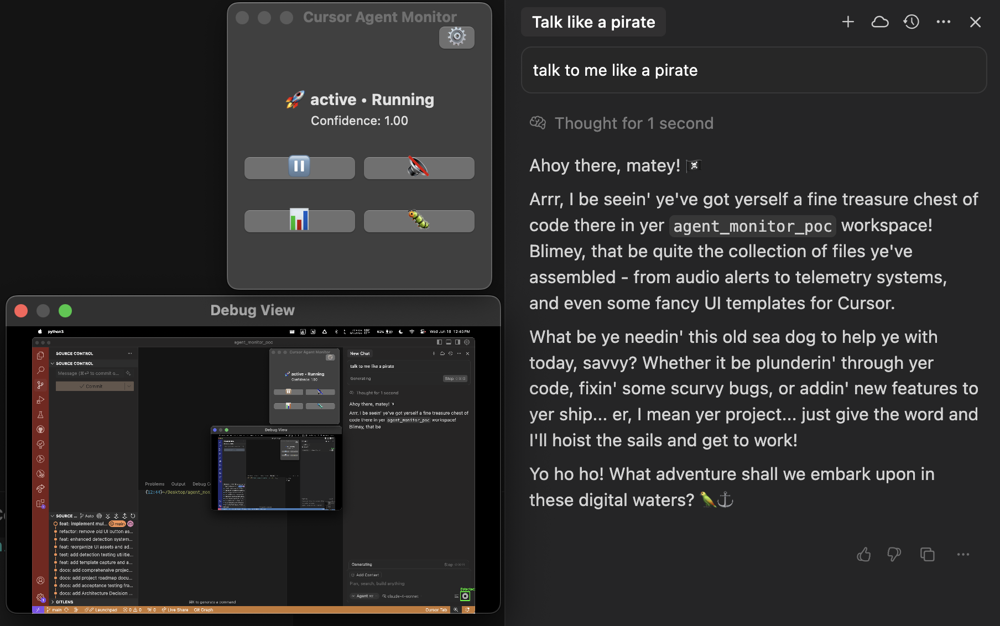
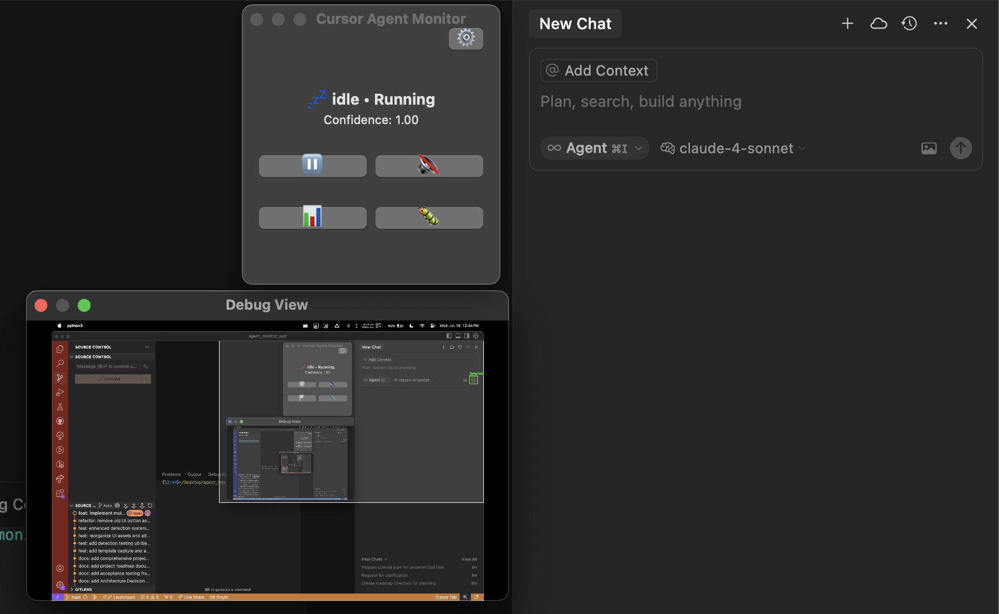
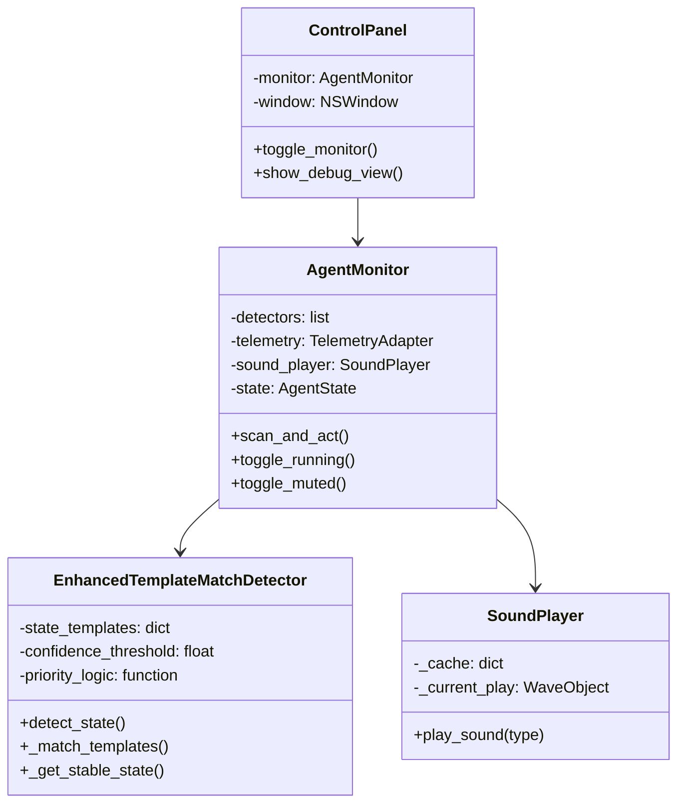
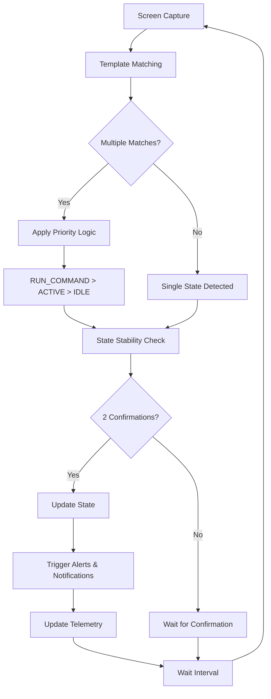

# Cursor Agent Monitor

A **production-ready** macOS application that intelligently monitors Cursor IDE's AI agent states with smart priority detection, distinct alert sounds, and automated notifications. Never miss when your AI agent needs attention or when commands are ready to execute!

**🎉 Version 1.0.0** - Now with intelligent **RUN_COMMAND** detection, recurring alerts, and rock-solid state management.

## Table of Contents
- [Cursor Agent Monitor](#cursor-agent-monitor)
  - [Table of Contents](#table-of-contents)
  - [✨ What's New in v1.0.0](#-whats-new-in-v100)
  - [🚀 Quick Start](#-quick-start)
  - [🎯 Key Features](#-key-features)
  - [📱 Screenshots](#-screenshots)
    - [Active State Detection](#active-state-detection)
    - [Idle State Detection](#idle-state-detection)
    - [Run Command State Detection](#run-command-state-detection)
  - [🧠 Smart Detection System](#-smart-detection-system)
    - [Priority Logic](#priority-logic)
    - [State Definitions](#state-definitions)
  - [🔊 Alert System](#-alert-system)
  - [🛠️ Template Management](#️-template-management)
    - [Quick Template Updates](#quick-template-updates)
    - [Template Organization](#template-organization)
  - [⚙️ Configuration](#️-configuration)
  - [🏗️ Architecture](#️-architecture)
    - [Component Overview](#component-overview)
    - [Detection Flow](#detection-flow)
  - [📊 Telemetry \& Analytics](#-telemetry--analytics)
  - [🔧 Development](#-development)
  - [🎵 Sound Customization](#-sound-customization)
  - [📋 Troubleshooting](#-troubleshooting)
  - [🗺️ Roadmap](#️-roadmap)

## ✨ What's New in v1.0.0

- **🎯 Smart Priority Logic**: RUN_COMMAND state automatically takes priority over ACTIVE when both are detected
- **⚡ Run Command Detection**: Never miss when Accept/Run buttons appear - get immediate notifications
- **🔔 Recurring Alerts**: Both idle and run_command states alert every 60 seconds with elapsed time
- **🎵 Distinct Sounds**: Different alert tones for each state (ascending for run_command, simple for idle)
- **🛡️ Rock-Solid Stability**: Fixed state switching issues, no more unknown/active flickering
- **🛠️ Easy Template Management**: New capture tool for quick template updates
- **⚠️ Smart Validation**: Automatic detection of problematic templates with helpful warnings
- **🚪 Graceful Shutdown**: Proper Ctrl+C handling for clean exits

## 🚀 Quick Start

Get up and running in under 2 minutes:

```bash
# 1. Clone and setup
git clone <repository-url>
cd agent_monitor_poc
./setup.sh

# 2. Start monitoring
./run.sh
```

**That's it!** A floating control panel will appear. The monitor will automatically detect:
- 💤 **Idle states** - when your AI agent needs input
- 🚀 **Active states** - when your AI agent is generating responses  
- ⚡ **Run command states** - when Accept/Run buttons appear (PRIORITY!)

### First Time Setup Tips
1. **Position Cursor IDE** where the monitor can see the AI panel
2. **Test detection** by triggering different states in Cursor
3. **Adjust templates** if needed using `./run_capture_tool.sh`
4. **Customize sounds** by replacing files in `assets/audio/alerts/`

## 🎯 Key Features

### 🧠 Intelligent State Detection
- **Template Matching**: High-precision OpenCV detection with confidence scoring
- **Smart Priority System**: RUN_COMMAND > ACTIVE > IDLE automatic prioritization
- **OCR Fallback**: Text recognition when template matching isn't sufficient
- **State Stability**: Requires 2 consistent detections to prevent flickering

### 🔔 Never Miss Anything
- **Instant Notifications**: macOS notifications for all state changes
- **Recurring Alerts**: Repeat notifications every 60 seconds for idle and run_command states
- **Distinct Alert Sounds**: 
  - 🎵 Ascending tone for urgent run_command alerts
  - 🎵 Simple two-note for idle alerts
  - 🎵 No sound for active states (avoid interruption)
- **Visual Status**: Floating control panel with emoji indicators

### 🛠️ Developer-Friendly
- **Easy Template Updates**: `./run_capture_tool.sh` for quick template capture
- **Comprehensive Analytics**: SQLite database with detailed telemetry
- **Debug Mode**: Real-time detection visualization and confidence logging
- **Automated Versioning**: Semantic versioning with automated release scripts

### 🏗️ Professional Architecture
- **Modular Design**: Pluggable detection strategies with clean interfaces
- **Dependency Injection**: Modern IoC container for service management
- **State Machine**: Intelligent agent interaction flow management
- **Error Handling**: Robust exception management and graceful degradation

## 📱 Screenshots

### Active State Detection


*AI agent actively generating responses (🚀)*

### Idle State Detection  


*AI agent waiting for user input (💤)*

### Run Command State Detection
*🚨 **NEW!** High-priority state when Accept/Run buttons appear (⚡)*

## 🧠 Smart Detection System

### Priority Logic
The monitor uses intelligent priority ranking to handle overlapping states:

1. **⚡ RUN_COMMAND** (Priority 1) - Immediate user action required
   - Accept/Run buttons visible
   - Triggers urgent ascending alert
   - Repeats every 60 seconds: *"🚨 COMMAND STILL WAITING - 2:15 elapsed"*

2. **🚀 ACTIVE** (Priority 2) - AI generating responses  
   - Agent processing/thinking
   - No sound (avoids interruption)
   - Shows confidence and status

3. **💤 IDLE** (Priority 3) - Waiting for user input
   - Agent ready for new requests
   - Simple two-note alert
   - Repeats every 60 seconds: *"Still idle after 1:30"*

### State Definitions
- **IDLE**: Agent is waiting for user input or commands
- **ACTIVE**: Agent is processing, generating, or executing tasks
- **RUN_COMMAND**: Accept/Run buttons are visible - requires immediate user action
- **UNKNOWN**: Detection confidence too low or conflicting signals

## 🔊 Alert System

### Sound Files
- `alert_ascending.wav` - **RUN_COMMAND** (urgent, attention-grabbing)
- `alert_idle_simple.wav` - **IDLE** (gentle, non-intrusive)
- `alert_warning.wav` - **Alternative** for run_command alerts
- `alert_error.wav`, `alert_success.wav`, etc. - **System events**

### Notification Types
- **Initial alerts**: Triggered on state changes
- **Recurring alerts**: Every 60 seconds for idle and run_command
- **System notifications**: macOS notification center integration
- **Visual feedback**: Control panel status updates

## 🛠️ Template Management

### Quick Template Updates

When detection accuracy needs improvement:

```bash
# 1. Launch the template capture tool
./run_capture_tool.sh

# 2. Navigate to the state you want to capture in Cursor
# 3. Position your mouse over the UI element
# 4. Press SPACE to capture
# 5. Follow the prompts to save the template

# 6. Restart the monitor to use new templates
./run.sh
```

### Template Organization
```
assets/ui-cursor/
├── agent_active/           # Active/generating state templates
│   ├── active_template_20250627_101104.png
│   ├── active_template_20250627_101308.png
│   └── generating_button.png
├── agent_idle/            # Idle state templates  
│   ├── idle_template_20250618_121216.png
│   ├── idle_template_20250618_123700.png
│   └── idle_template_20250627_101801.png
└── run_command/           # Accept/Run button templates
    ├── run_command_template_20250627_103259.png
    └── run_command_template_20250627_110953.png
```

### Template Best Practices
- **Clear UI elements**: Capture distinctive parts of buttons/indicators
- **Consistent sizing**: Keep templates reasonably small (50-150px)
- **Multiple variants**: Capture different UI states for better coverage
- **Test thoroughly**: Verify new templates work across different scenarios

## ⚙️ Configuration

### Template Detection Settings
```python
# In agent_monitor_poc.py
CONFIDENCE_THRESHOLD = 0.8      # Minimum match confidence
MIN_CONFIDENCE_GAP = 0.1        # Gap between competing detections
REQUIRED_CONFIRMATIONS = 2      # Stable state confirmations needed
```

### Alert Timing
```python
IDLE_ALERT_REPEAT_INTERVAL = 60           # Idle alert frequency (seconds)
RUN_COMMAND_ALERT_REPEAT_INTERVAL = 60    # Run command alert frequency
```

### Diagnostic Mode
```python
DIAGNOSTIC_MODE = True          # Enable detailed logging
DIAGNOSTIC_VERBOSITY = "high"   # "low", "medium", "high"
CLEAR_CONSOLE_ON_UPDATE = False # Clear console on state changes
```

## 🏗️ Architecture

### Component Overview



### Detection Flow



## 📊 Telemetry & Analytics

### Database Features
- **Rich Event Logging**: All state changes with confidence scores and timestamps
- **Detection Accuracy Tracking**: Monitor system performance over time
- **State Duration Analytics**: How long the agent spends in each state
- **Template Performance**: Which templates work best

### Analytics CLI
```bash
# View recent activity
./run_analytics.sh events --limit 20

# Generate performance reports  
./run_analytics.sh stats --hours 24

# Create visualization charts
./run_analytics.sh chart activity_heatmap --days 7

# Export data for analysis
./run_analytics.sh export data.csv --days 30
```

## 🔧 Development

### Development Workflow
```bash
# 1. Activate environment
source venv/bin/activate

# 2. Make changes to agent_monitor_poc.py

# 3. Test changes
./run.sh

# 4. View debug information
# Use "Show Debug View" in control panel

# 5. Run tests
./run_tests.sh

# 6. Commit using conventional commits
git commit -m "feat(detection): improve run_command accuracy"
```

### Adding New Detection States
1. **Define new state** in `AgentState` class
2. **Add templates** to appropriate `assets/ui-cursor/` directory
3. **Update priority logic** in `EnhancedTemplateMatchDetector`
4. **Add sound file** to `assets/audio/alerts/`
5. **Update sound mapping** in `ALERT_SOUNDS`
6. **Test thoroughly** with different scenarios

### Release Process
```bash
# Automated semantic versioning
./release.sh patch    # Bug fixes (1.0.0 -> 1.0.1)
./release.sh minor    # New features (1.0.0 -> 1.1.0)
./release.sh major    # Breaking changes (1.0.0 -> 2.0.0)
```

## 🎵 Sound Customization

### Available Alert Sounds
- `alert_ascending.wav` - Rising tone sequence (run_command)
- `alert_descending.wav` - Falling tone sequence
- `alert_idle_simple.wav` - Gentle two-note (idle)
- `alert_notification.wav` - Standard notification
- `alert_warning.wav` - Attention-grabbing warning
- `alert_success.wav` - Positive completion sound
- `alert_error.wav` - Error indication
- `alert_thinking.wav` - Processing indicator
- `alert_completed.wav` - Task completion
- `alert_waiting.wav` - Waiting/pending state
- `alert_custom_tada.wav` - Celebration sound

### Creating Custom Sounds
```bash
# Use the sound generator
cd assets/audio/scripts/
python sound_generator.py

# Or create custom alerts
python custom_alert_example.py
```

## 📋 Troubleshooting

### Common Issues

**🔧 Detection Not Working**
- Check template files exist in `assets/ui-cursor/`
- Verify Cursor IDE is visible on screen
- Lower `CONFIDENCE_THRESHOLD` if too strict
- Use Debug View to see detection confidence

**🔇 No Sound Alerts**
- Check sound files exist in `assets/audio/alerts/`
- Verify system volume is up
- Check if monitor is muted (toggle in control panel)
- Ensure sound player has permissions

**⚠️ Template Warnings**
```
[⚠️ WARNING] Idle template 'template.png' has suspiciously high confidence (1.00)!
[⚠️ WARNING] This template might be too generic and matching active states!
```
**Solution**: Recapture template with more specific UI elements

**🔄 Constant State Switching**
- Increase `MIN_CONFIDENCE_GAP` to 0.2 or higher
- Add more specific templates for better differentiation
- Check for UI animations that might affect detection

### Debug Mode
Enable detailed logging:
```python
DIAGNOSTIC_MODE = True
DIAGNOSTIC_VERBOSITY = "high"
```

Look for these debug messages:
- `[DETECTOR_WINNER]` - Which detector won and why
- `[PRIORITY_LOGIC]` - Priority decision process
- `[STATE_LOGIC]` - State stability tracking
- `[⚠️ WARNING]` - Template quality issues

## 🗺️ Roadmap

### Short Term (v1.1.x)
- **Cross-IDE Support**: Templates for VS Code, IntelliJ, etc.
- **Custom Alert Scheduling**: Different intervals per state
- **Template Auto-Update**: Machine learning template optimization
- **Hotkey Support**: Keyboard shortcuts for common actions

### Medium Term (v1.2.x)
- **Multi-Monitor Support**: Detection across multiple displays
- **API Integration**: REST API for external system integration
- **Advanced Analytics**: Machine learning insights and predictions
- **Cloud Sync**: Template and settings synchronization

### Long Term (v2.x)
- **Universal AI Agent Monitor**: Support for any AI assistant
- **Real-time Dashboard**: Web-based monitoring interface
- **Team Analytics**: Multi-user deployment and analytics
- **Plugin Architecture**: Third-party detection extensions

---

**🎉 Enjoy your production-ready AI agent monitor!** 

For detailed documentation see:
- `CHANGELOG.md` - Version history and changes
- `docs/GIT_STRATEGY.md` - Development workflow and conventions
- `TELEMETRY_README.md` - Analytics system documentation
- `DEV_QUICKSTART.md` - Developer quickstart guide
